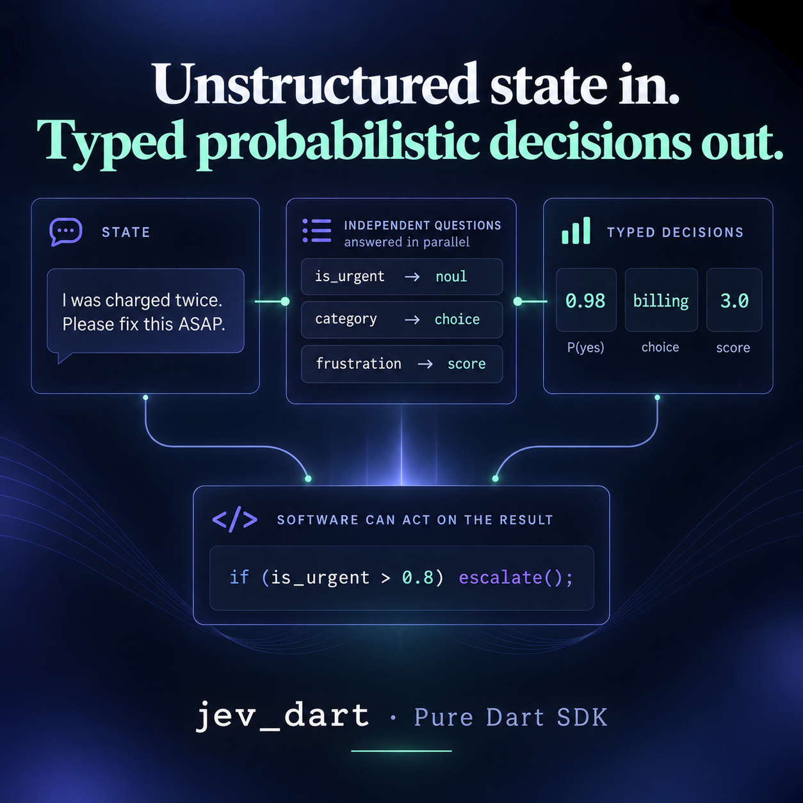
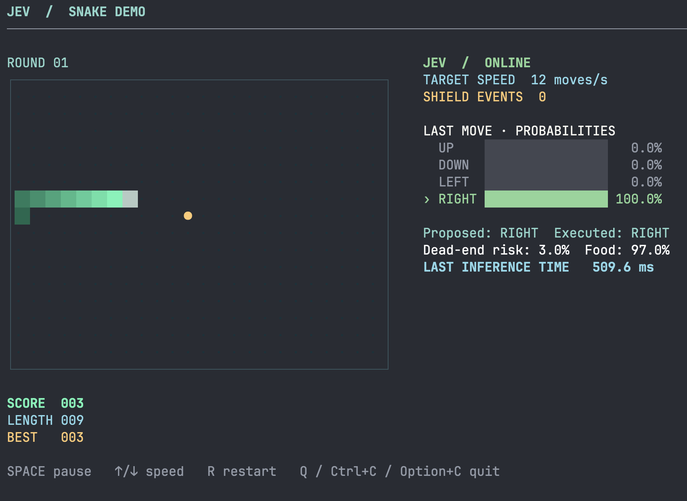

# jev_dart

Dart client for [TypeSafe AI](https://typesafe.ai) — Jev, the System One model.

Send **state** and typed **questions** (`noul`, `choice`, `score`); get structured answers your code can branch on.

This is a **pure Dart** package (no Flutter dependency). Use it from a CLI, a server, or a Flutter app via `import 'package:jev_dart/jev_dart.dart'`.



**Speed and memory use are core design priorities—and a key differentiator of this implementation.** The request path is built to avoid unnecessary work and short-lived copies, while keeping connections reusable. That means less client-side encoding and decoding overhead on each call, without changing the typed API.



## Install

```yaml
dependencies:
  jev_dart: ^0.1.4
```

Set `TYPESAFE_API_KEY` or `JEV_API_KEY` (also loaded from `.env` in tests and the example), then:

```dart
import 'package:jev_dart/jev_dart.dart';

void main() async {
  final client = TypeSafeClient();
  final result = await client.systemOne(
    state: {'document': 'I was charged twice. Please fix this ASAP.'},
    questions: {
      'category': choice('What is this ticket about?', {
        'billing': null,
        'technical': null,
        'other': null,
      }),
    },
  );
  print(result.choice('category').choice);
  client.close();
}
```

## Performance and memory

The hot path is designed to reduce both latency and transient memory use:

- **Reuse the connection.** One long-lived HTTP client lets the VM transport pool and reuse its HTTP/2 connection instead of creating a new client for every request. Close the `TypeSafeClient` when you are done with it.
- **Encode once, straight to bytes.** Request JSON is written directly as UTF-8 bytes, avoiding the intermediate JSON string and second UTF-8 encoding. The resulting bytes are also reused across retries, so retrying does not serialize the same payload again.
- **Parse response bytes directly.** On VM, mobile, and desktop, UTF-8 JSON responses are read from their original bytes with Crimson, avoiding an intermediate response string on the normal JSON path.
- **Keep a compatibility fallback.** Values that rely on `toJson()` use Dart's standard JSON encoder. Non-JSON responses and parser failures use the tolerant `dart:convert` path.

These choices target the SDK work it can control; total request time still depends on the network and the API response. The package does not publish comparative benchmark numbers.

## HTTP transport

- **VM / mobile / desktop:** default client is [`Http2Client`](https://pub.dev/packages/http2) (`http2: ^3.1.0`), with pooled HTTP/2 connections to `api.typesafe.ai`.
- **Web:** `package:http` delegates to the browser's HTTP transport. `http2` requires `dart:io`.
- Caller cancellation and timeouts stop waiting in the SDK; the SDK does not send an abort signal, so work already sent may continue in the background on either the default or an injected transport.

On Web, the package uses Dart's `JsonUtf8Encoder` and standard decoder because Crimson's current VM-oriented implementation is not JavaScript-safe.

## Flutter

Import this package. Do not add a Flutter plugin wrapper unless you need widgets or native channels.

## Configuration

Constructor values override environment variables, then SDK defaults.

| Option | Env | Default |
|---|---|---|
| `apiKey` | `TYPESAFE_API_KEY` | required |
| `baseUrl` | `TYPESAFE_BASE_URL` | `https://api.typesafe.ai` |
| `defaultModel` | `TYPESAFE_DEFAULT_MODEL` | `jev-latest` |
| `logLevel` | `TYPESAFE_LOG_LEVEL` | `warn` |
| `timeout` | — | 10s per attempt |
| `retry` | — | 2 retries, 408/429/5xx |

## Example

`example/main.dart` runs three live cases (TypeSafe [quickstart playground](https://docs.typesafe.ai/introduction/quickstart), the [JS SDK demo](https://github.com/typesafe-ai/typesafe-sdk-js/blob/main/examples/demo.ts), and a calm contrast ticket) and **checks** the answers (urgency high vs low, billing vs not sales, etc.):

```sh
dart run example/main.dart
```

Docs: [https://docs.typesafe.ai/](https://docs.typesafe.ai/)
